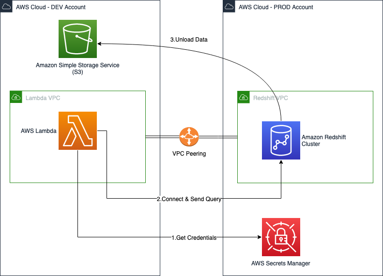

The purpose of this code is to extract (unload) data from an Amazon Redshift cluster supposedly on a production environment using an SQL query and save them to an Amazon Simple Storage Service (Amazon S3) bucket that exists in a development environment.

## Table of Contents

- [Description](#description)
- [Prerequisites](#prerequisites)
- [Architecture](#architecture)
- [Limitations](#limitations)
- [Disclaimer](#disclaimer)
- [Security](#security)

## Description

This lab walks through the setup of both DEV and PROD accounts. It provisions them with the required resources, such as AWS Identity and Access Management (IAM) roles, network adjustments, and an AWS Lambda function to put the whole architecture to test. A Lambda function with a Python runtime is used for that purpose.

To grant access to the Redshift cluster, the pattern stores the relevant credentials in AWS Secrets Manager. The benefit of this approach is having the all the information that is required to connect directly to the Redshift cluster without needing to know where it resides. Additionally, [usage of the secret can be monitored](https://docs.aws.amazon.com/secretsmanager/latest/userguide/monitoring.html).

The secret that is saved in the Secrets Manager will include the Redshift cluster host, database name, port and relevant credentials.

## Prerequisites
 
- Two AWS accounts: PROD and DEV
- An Amazon Redshift cluster running on the PROD account
- An S3 bucket in the DEV Account
- A virtual private cloud (VPC) [peering connection](https://docs.aws.amazon.com/vpc/latest/peering/create-vpc-peering-connection.html) between the DEV and PROD accounts, with the [route tables](https://docs.aws.amazon.com/vpc/latest/peering/vpc-peering-routing.html) adjusted accordingly
- The [Domain Name System](https://docs.aws.amazon.com/vpc/latest/userguide/vpc-dns.html) hostnames and DNS resolution enabled for both peered VPCs

## Architecture

1. In the DEV account, the Lambda function does the following:
    - Assumes the relevant IAM role for accessing the Amazon Redshift credentials in Secrets Manager in the PROD account
    - Retrieves the Amazon Redshift cluster secret
2. In the DEV account, the Lambda function does the following:
    - Uses the information from Secrets Manager to connect to the Amazon Redshift cluster in the PROD account through the peered VPCs
    - Sends an unload command to query the Amazon Redshift cluster
3. In the PROD account, the Amazon Redshift cluster does the following:
    - Assumes the relevant IAM roles to access the S3 bucket in the DEV account
    - Unloads the queried data to the S3 bucket

## Limitations 

Lambda runtime is limited to 15 minutes. Depending on the amount of data that you want to query, the Lambda function might time out.

If your runtime will be longer than 15 minutes, you need to use an asynchronous approach for your Lambda code. However, the example code for this pattern uses the library psycopg2 for Python, which doesn't support that yet.

## Disclaimer

When copying sensitive data between the accounts, it is crucial to be informed about the consequences, including for compliance and security. A good first step is to ensure that the data is, at least, anonymized or obscured, and that the data is deleted after the relevant tests or development efforts are completed. 

Additionally, the two accounts should have identical security measures applied so that data is not at risk of any unnecessary exposure.

## Security

See [CONTRIBUTING](CONTRIBUTING.md) for more information.
